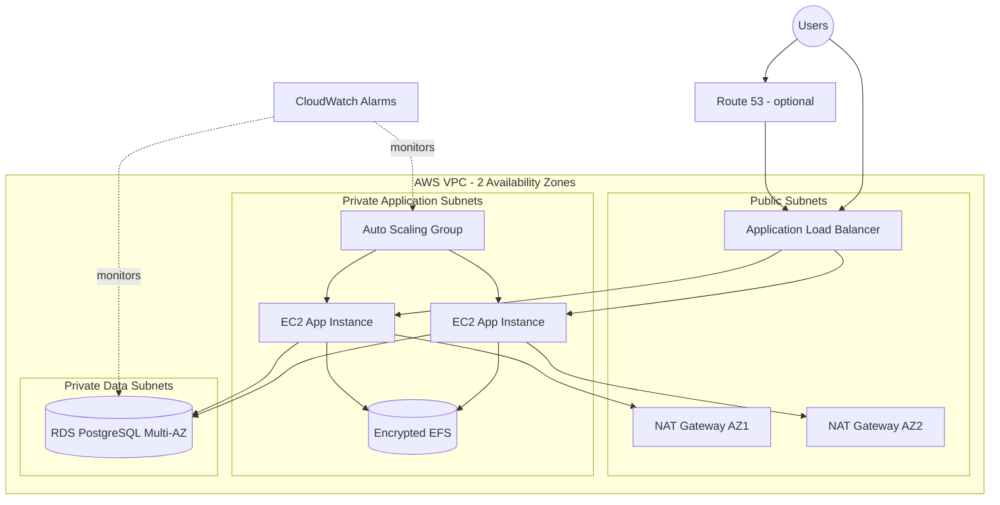

# AWS Production-Style Infrastructure with Terraform

Production-inspired Infrastructure as Code project demonstrating a highly available AWS web platform built with reusable Terraform modules.

> **Portfolio status:** architecture and Terraform implementation are prepared in the repository. Deployment is **not claimed as verified** until the stack is successfully applied and tested in an AWS account.

## Advanced architecture



## What the advanced implementation includes

- VPC spanning two Availability Zones
- two public subnets
- two private application subnets
- two private data subnets
- Internet Gateway and public routing
- NAT Gateway per Availability Zone
- Application Load Balancer
- isolated ALB and application security groups
- optional Route53 DNS + ACM certificate + HTTPS listener
- HTTP-to-HTTPS redirect when TLS is configured
- EC2 Launch Template
- Auto Scaling Group across private application subnets
- target-tracking CPU scaling policy
- Amazon Linux 2023 AMI discovery
- IMDSv2 enforcement
- encrypted gp3 root volumes
- IAM instance profile with Systems Manager access
- PostgreSQL RDS Multi-AZ
- encrypted database storage and storage autoscaling
- AWS-managed RDS master password through Secrets Manager
- encrypted EFS with mount targets across application subnets
- security-group-to-security-group access for database and NFS traffic
- CloudWatch alarms for ASG capacity, RDS CPU, and RDS free storage
- S3 remote-state bootstrap with versioning, encryption, and public-access blocking
- DynamoDB state-lock table
- GitHub Actions Terraform formatting and validation
- Checkov Terraform security scanning

## Repository structure

```text
aws-terraform-infrastructure/
├── advanced/
│   ├── bootstrap/
│   │   └── state/
│   ├── environments/
│   │   └── dev/
│   └── modules/
│       ├── networking/
│       ├── load-balancer/
│       ├── compute/
│       ├── database/
│       ├── storage/
│       └── monitoring/
├── terraform/                 # smaller baseline implementation
├── docs/
│   ├── architecture.md
│   ├── advanced-architecture.md
│   └── deployment-checklist.md
└── .github/workflows/
    └── terraform-ci.yml
```

## Engineering decisions

### Private application tier

The load balancer is internet-facing, while EC2 application instances remain in private subnets. The application security group accepts application traffic from the ALB security group rather than from the public internet.

### Multi-AZ design

Networking, compute, database, and shared storage are designed across two Availability Zones to reduce reliance on a single failure domain.

### No SSH dependency

Application instances are designed without requiring public SSH access. The instance role includes AWS Systems Manager access for operational management.

### Managed database credentials

The RDS master password is managed by AWS rather than stored in Terraform source code.

### Optional production edge

If `domain_name` and `route53_zone_name` are provided, Terraform requests and validates an ACM certificate, creates a Route53 alias to the ALB, enables HTTPS, and redirects HTTP traffic to HTTPS. Without those values, the environment remains reachable through the ALB DNS name over HTTP for simpler testing.

### Remote state bootstrap

`advanced/bootstrap/state/` creates a dedicated S3 state bucket with versioning, encryption, and public-access blocking plus a DynamoDB locking table. The application environment includes an S3 backend block and a `backend.hcl.example` file so state can be moved out of local storage after the bootstrap resources exist.

### Modular Terraform

The advanced environment composes separate modules for networking, traffic management, compute, database, storage, and monitoring instead of placing the entire platform in one file.

## CI / security checks

GitHub Actions checks Terraform formatting, validates both the remote-state bootstrap and advanced development environment, and runs Checkov against the advanced Terraform code.

The workflow does **not** deploy infrastructure and does not require AWS credentials.

## Deployment workflow

### 1. Bootstrap remote state

```bash
cd advanced/bootstrap/state
terraform init
terraform plan -var='state_bucket_name=YOUR_GLOBALLY_UNIQUE_BUCKET_NAME'
terraform apply -var='state_bucket_name=YOUR_GLOBALLY_UNIQUE_BUCKET_NAME'
```

### 2. Configure the backend

Copy `advanced/environments/dev/backend.hcl.example`, replace the bucket name, then initialize the advanced environment:

```bash
cd advanced/environments/dev
terraform init -backend-config=backend.hcl
```

### 3. Configure environment variables

```bash
cp terraform.tfvars.example terraform.tfvars
```

Set the two Availability Zones you want to use. DNS and HTTPS are optional and require an existing public Route53 hosted zone.

### 4. Validate and plan

```bash
terraform fmt
terraform validate
terraform plan
```

Only run `terraform apply` in an AWS account where you understand and accept the cost of the resources being created.

## Cost warning

This advanced architecture can generate meaningful AWS charges. In particular, **NAT Gateways, the Application Load Balancer, EC2, RDS Multi-AZ, EFS, and public IPv4 usage may incur costs**. Destroy temporary application infrastructure when it is no longer needed.

```bash
terraform destroy
```

The state bootstrap is intentionally separate and its S3 bucket has `prevent_destroy` enabled.

## Deployment evidence

The repository includes `docs/deployment-checklist.md` describing what should be tested and captured after a real deployment: healthy ALB targets, Auto Scaling capacity, RDS Multi-AZ, EFS mount targets, CloudWatch alarms, optional HTTPS, and sanitized Terraform outputs.

## Baseline implementation

The original `terraform/` directory remains in the repository as a smaller VPC + EC2 demonstration. The `advanced/` directory is the main portfolio architecture.

## Current status

**Advanced Terraform implementation: repository-complete / deployment unverified.**

The remaining step is not more architecture code. It is a real, controlled AWS deployment and verification run. Until that happens, this repository intentionally avoids claiming that the infrastructure has been successfully deployed.