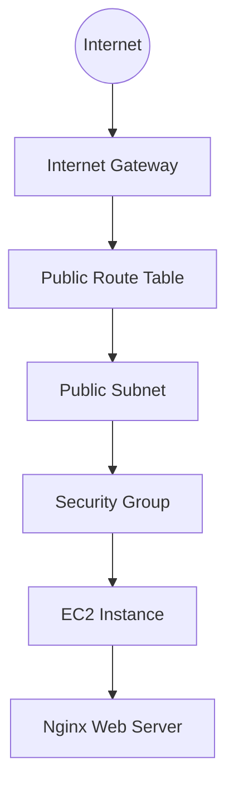

# AWS Infrastructure with Terraform

Infrastructure as Code project for deploying a simple AWS web workload with Terraform.

## Architecture



## What this project defines

- AWS provider configuration
- VPC
- public subnet
- internet gateway
- public route table and association
- security group allowing HTTP
- EC2 instance
- automated Nginx installation with `user_data`
- Terraform outputs for the public IP and web URL

## Repository structure

```text
aws-terraform-infrastructure/
├── README.md
├── .gitignore
├── terraform/
│   ├── versions.tf
│   ├── variables.tf
│   ├── main.tf
│   ├── outputs.tf
│   └── terraform.tfvars.example
└── docs/
    └── architecture.md
```

## Terraform workflow

```bash
cd terraform
terraform init
terraform fmt
terraform validate
terraform plan
terraform apply
```

After testing the deployment:

```bash
terraform destroy
```

## Configuration

Copy the example variables file if you want to override defaults:

```bash
cp terraform.tfvars.example terraform.tfvars
```

Do not commit credentials, `.tfstate` files, or local Terraform working directories.

## Security notes

This is a portfolio/demo architecture rather than a production reference architecture.

- HTTP port 80 is open publicly so the demo web page can be reached.
- SSH is not opened by default.
- AWS credentials are expected to be provided through the normal AWS provider credential chain, not hard-coded in Terraform.
- Terraform state is ignored by Git in this repository.

## Cost awareness

Creating AWS resources can incur charges. The configuration is intentionally small, and resources should be destroyed after testing when they are no longer needed.

## Status

**Infrastructure code prepared.**

This repository documents the Terraform configuration and architecture. A deployment should only be marked as verified once the configuration has been successfully applied in an AWS account and the resulting endpoint has been tested.
