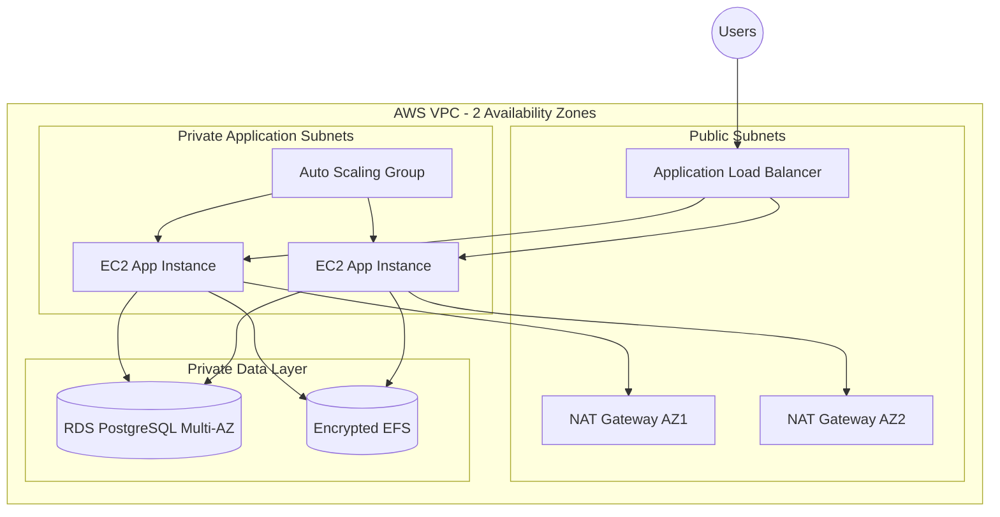

# AWS Production-Style Infrastructure with Terraform

Production-inspired Infrastructure as Code project demonstrating a highly available AWS web platform built with reusable Terraform modules.

> **Portfolio status:** architecture and Terraform implementation are prepared in the repository. Deployment is **not claimed as verified** until the stack is successfully applied and tested in an AWS account.

## Advanced architecture



## What the advanced implementation includes

- VPC spanning two Availability Zones
- two public subnets
- two private application subnets
- two private data subnets
- Internet Gateway and public routing
- NAT Gateway per Availability Zone
- Application Load Balancer
- isolated ALB and application security groups
- EC2 Launch Template
- Auto Scaling Group across private application subnets
- target-tracking CPU scaling policy
- Amazon Linux 2023 AMI discovery
- IMDSv2 enforcement
- encrypted gp3 root volumes
- IAM instance profile with Systems Manager access
- PostgreSQL RDS Multi-AZ
- encrypted database storage and storage autoscaling
- AWS-managed RDS master password through Secrets Manager
- encrypted EFS with mount targets across application subnets
- security-group-to-security-group access for database and NFS traffic
- GitHub Actions Terraform formatting and validation
- Checkov Terraform security scanning

## Repository structure

```text
aws-terraform-infrastructure/
├── advanced/
│   ├── environments/
│   │   └── dev/
│   └── modules/
│       ├── networking/
│       ├── load-balancer/
│       ├── compute/
│       ├── database/
│       └── storage/
├── terraform/                 # smaller baseline implementation
├── docs/
│   ├── architecture.md
│   └── advanced-architecture.md
└── .github/workflows/
    └── terraform-ci.yml
```

## Engineering decisions

### Private application tier

The load balancer is internet-facing, while EC2 application instances remain in private subnets. The application security group accepts application traffic from the ALB security group rather than from the public internet.

### Multi-AZ design

Networking, compute, database, and shared storage are designed across two Availability Zones to reduce reliance on a single failure domain.

### No SSH dependency

Application instances are designed without requiring public SSH access. The instance role includes AWS Systems Manager access for operational management.

### Managed database credentials

The RDS master password is managed by AWS rather than stored in Terraform source code.

### Modular Terraform

The advanced environment composes separate modules for networking, traffic management, compute, database, and storage instead of placing the entire platform in one file.

## CI / security checks

GitHub Actions runs Terraform formatting and validation against the advanced environment and executes Checkov against the Terraform code.

The workflow does **not** deploy infrastructure and does not require AWS credentials.

## Running the advanced configuration

```bash
cd advanced/environments/dev
terraform init
terraform fmt
terraform validate
terraform plan
```

Only run `terraform apply` in an AWS account where you understand and accept the cost of the resources being created.

## Cost warning

This advanced architecture can generate meaningful AWS charges. In particular, **NAT Gateways, the Application Load Balancer, EC2, RDS Multi-AZ, EFS, and public IPv4 usage may incur costs**. Destroy test infrastructure when it is no longer needed.

```bash
terraform destroy
```

## Baseline implementation

The original `terraform/` directory remains in the repository as a smaller VPC + EC2 demonstration. The `advanced/` directory is the main portfolio architecture.

## Current status

**Advanced Terraform implementation: repository-complete / deployment unverified.**

The code demonstrates the architecture and engineering approach without pretending that an AWS deployment has already been successfully validated. Once the stack is deployed, the next evidence to add should be real outputs such as an ALB endpoint, healthy target state, Auto Scaling activity, CloudWatch evidence, and sanitized deployment screenshots.