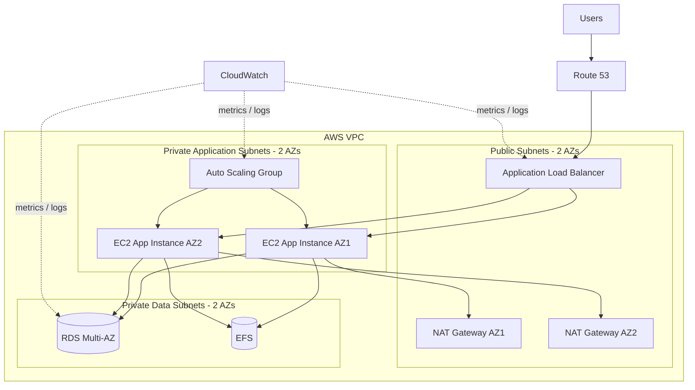

# Advanced AWS Reference Architecture

This document defines the **advanced target architecture** for this project. It is intentionally separated from the smaller Terraform demo so the repository does not claim resources that have not yet been deployed and verified.

## Target design



## Core components

| Layer | AWS services | Purpose |
|---|---|---|
| DNS | Route 53 | Public DNS and application entry point |
| Edge / traffic | Application Load Balancer | Distribute HTTP/HTTPS traffic across healthy instances |
| Network | VPC, subnets, route tables, Internet Gateway, NAT Gateways | Isolate public, application, and data tiers |
| Compute | EC2 Launch Template + Auto Scaling Group | Replace unhealthy instances and scale horizontally |
| Database | RDS Multi-AZ | Managed relational database with high-availability failover |
| Shared storage | EFS + mount targets | Shared file storage across application instances |
| Security | Security Groups, IAM roles | Restrict east-west and north-south access and avoid static credentials |
| Observability | CloudWatch | Metrics, logs, alarms, and operational visibility |

## Network layout

The target uses **two Availability Zones**. Each AZ contains:

- one public subnet
- one private application subnet
- one private data subnet

The Application Load Balancer lives in the public subnets. Application instances live in private subnets and do not require direct inbound internet access. Data services live in separate private data subnets.

A production-oriented design would normally use a NAT Gateway per Availability Zone to avoid creating a cross-AZ dependency for outbound traffic.

## Security model

The intended traffic path is:

```text
Internet
  ↓
Route 53
  ↓
Application Load Balancer : 80/443
  ↓
Application Security Group
  ↓
EC2 application instances
  ↓
Database / shared storage security groups
```

Security groups should reference other security groups where possible instead of broad CIDR rules.

Example policy:

- ALB SG: allow public HTTP/HTTPS
- App SG: allow application traffic only from the ALB SG
- DB SG: allow the database port only from the App SG
- EFS SG: allow NFS only from the App SG
- no public SSH requirement for application instances

## High availability

This target architecture removes several single points of failure present in a one-instance demo:

- workload spans two Availability Zones
- load balancer performs health checks
- Auto Scaling replaces unhealthy compute instances
- RDS Multi-AZ provides database failover capability
- EFS is reachable through mount targets in the VPC
- separate NAT Gateways can provide AZ-local outbound paths

## Terraform structure for the advanced version

```text
advanced/
├── environments/
│   └── dev/
│       ├── main.tf
│       ├── variables.tf
│       ├── outputs.tf
│       └── terraform.tfvars.example
├── modules/
│   ├── networking/
│   ├── load-balancer/
│   ├── compute/
│   ├── database/
│   ├── storage/
│   └── monitoring/
└── README.md
```

The advanced version should use reusable modules rather than placing every resource in a single Terraform file.

## Planned advanced capabilities

- multi-AZ VPC design
- public and private routing
- NAT Gateway per AZ
- Application Load Balancer
- Launch Template
- Auto Scaling Group
- RDS Multi-AZ
- EFS mount targets
- IAM instance role
- CloudWatch alarms
- HTTPS with ACM
- Route 53 alias record
- remote Terraform state
- CI checks for `terraform fmt`, `validate`, and security scanning

## Implementation status

**Architecture target only — not yet claimed as deployed.**

The existing `terraform/` directory remains the smaller working baseline. The architecture above is the direction for the advanced portfolio implementation.