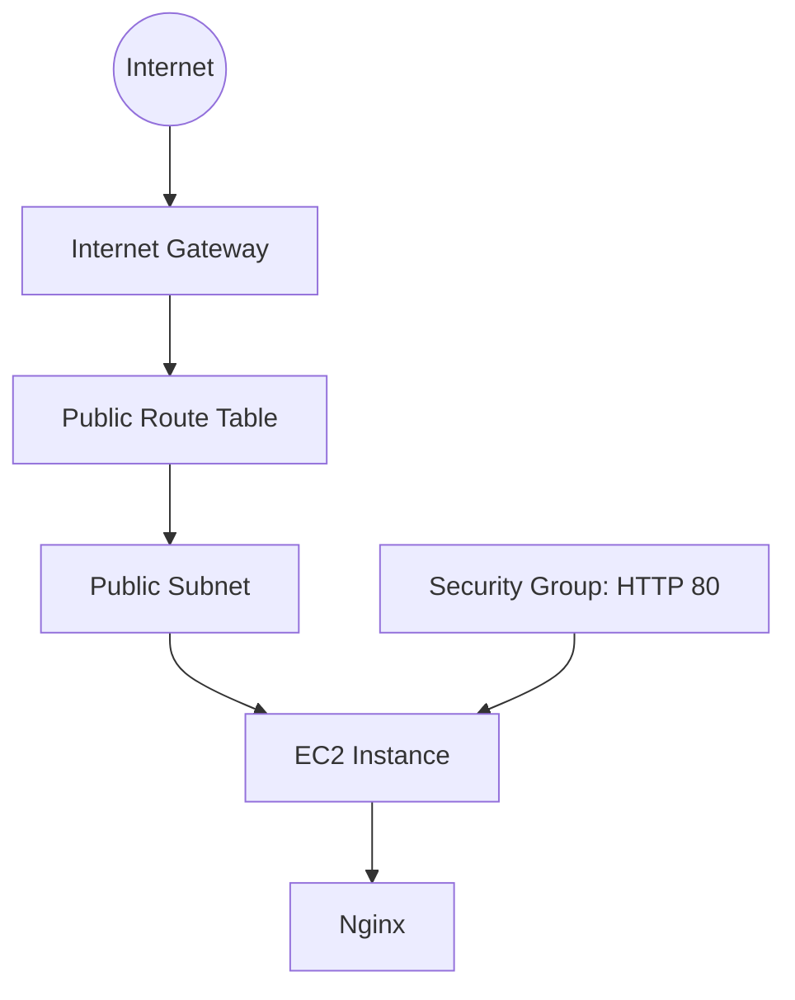

# Architecture

## Overview

This project defines a small public web workload in AWS using Terraform.

## Components

| Component | Purpose |
|---|---|
| VPC | Isolated network boundary for the project |
| Public subnet | Hosts the demo EC2 instance |
| Internet gateway | Provides internet connectivity to the VPC |
| Route table | Sends default outbound/inbound routed traffic through the internet gateway |
| Security group | Allows inbound HTTP traffic and outbound traffic |
| EC2 | Compute instance hosting the demo web service |
| Nginx | Web server installed automatically through EC2 user data |

## Design choices

### No SSH ingress

The security group does not expose port 22. The demo does not require SSH to prove the infrastructure works, which keeps the public attack surface smaller.

### AMI discovery through SSM Parameter Store

The Terraform configuration reads the current Amazon Linux 2023 AMI ID from the AWS-managed public SSM parameter rather than hard-coding an AMI ID that can become stale or vary by region.

### Automated instance bootstrap

EC2 `user_data` installs and starts Nginx and writes a simple web page. This makes the workload reproducible from Terraform rather than relying on manual server configuration.

### Public subnet by design

This first version intentionally uses a public subnet because the goal is to demonstrate VPC routing, security groups, compute provisioning, and automated web-server bootstrap with minimal infrastructure.

## Production differences

A production-style platform would normally introduce additional controls and architecture such as private application subnets, load balancing, high availability across multiple Availability Zones, managed TLS, stronger egress controls, observability, centralized state, and CI/CD validation.

Those features are intentionally outside this repository's current scope and can be introduced in a later advanced project.
